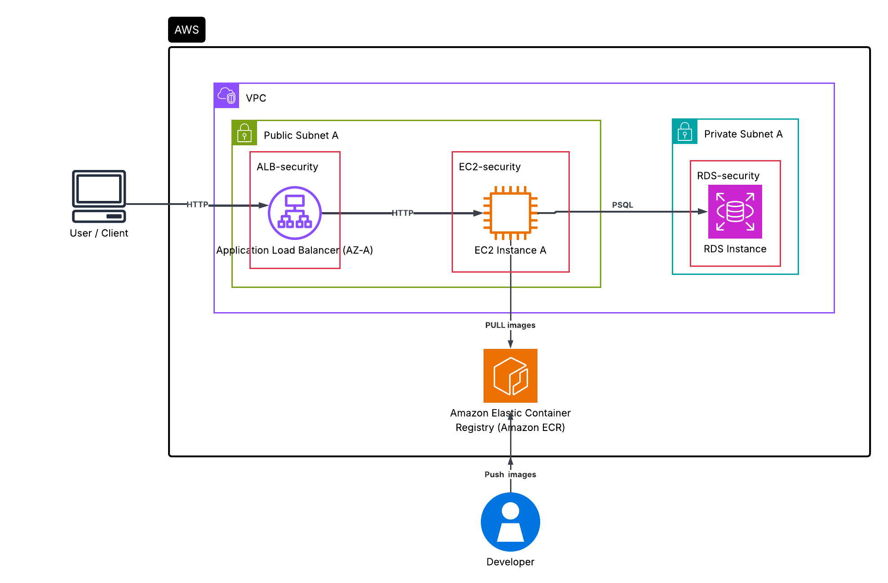

# End-to-End devops project

This assignment will be focusing on DevOps tools, tools we are going to use in this assignment are 
1. IaC -Terraform
2. CI/CD - Github Actions
3. Observability - Grafana, prometheus

The application is a simple three-tier web application consisting of a database (postgres), an API (flask), and a frontend (flask) took from a public repository. I have changed the application docker setup and other for production deployment.

Application repository : https://github.com/pdichone/docker-course-three-tier-web-app.git

## Infrastructure 
The infrastucture provisioned using terraform in AWS cloud. 
consists of  VPC, Subnets, Route Tables, Gateways, Security Groups, RDS, EC2, ECS, ECR, ALB, ASG.

### Tech Stack:
- Terraform
- AWS
- Docker

## Architecture


The application consists of two private and two public subnets in a custom VPC. The Application Load Balancer and EC2 instance are placed in the public subnets and the RDS instance is placed in the private subnets.

The ALB acts as the entry point to the application, it forwards the requests to the EC2 instance based on the path-based routing.

The EC2 instance hosts the API and frontend applications.

The RDS instance hosts the database.

security groups: 
ALB security - Will accept request from anywhere on port 80 as SSL is not configured. 
EC2 security - Will accept traffic from ALB security group on port 80. 
RDS security - Will accept traffic from EC2 security group on port 5432. 

Architecture Justification:
The EC2 instance is placed in public subnet as placing it in private subnet would require NAT gateway and setting up of SSM or bastion host to deploy the containers. 

### Infrastucture configuration steps
Clone the repo 

```git clone https://github.com/Yashwanth-tss/8bytes.git```

```cd 8bytes``` <br>
```terraform init``` <br>
```terraform plan``` <br>
```terraform apply -var="aws_region=ap-south-1" -var="db_username=your_username" -var="db_password=your_password" -var="db_name=your_db_name" -var="app_port=80" -var="my_ip=[IP_ADDRESS]"```

The infra is provisioned, now we need to deploy the docker images to the EC2 instance.

From the application folder, three-tier-web-app

#### Build the containers images

```docker build -t quotes-db ./db``` <br>

```docker build -t quotes-api ./api``` <br>

```docker build -t quotes-frontend ./app``` <br>


#### Log in to ECR using AWS CLI. 

```aws ecr get-login-password --region your-region | docker login --username AWS --password-stdin <your-ecr-account-id>.dkr.ecr.your-region.amazonaws.com```

#### Retag the images

```docker tag quotes-api:latest <your-ecr-account-id>.dkr.ecr.your-region.amazonaws.com/quotes-api:latest``` <br>
```docker tag quotes-frontend:latest <your-ecr-account-id>.dkr.ecr.your-region.amazonaws.com/quotes-frontend:latest```


#### push the images to ECR

```docker push <your-ecr-account-id>.dkr.ecr.your-region.amazonaws.com/quotes-api:latest``` <br>
```docker push <your-ecr-account-id>.dkr.ecr.your-region.amazonaws.com/quotes-frontend:latest```


now in EC2 instaces, pull the images and run the containers

```docker pull <your-ecr-account-id>.dkr.ecr.your-region.amazonaws.com/quotes-api:latest``` <br>
```docker pull <your-ecr-account-id>.dkr.ecr.your-region.amazonaws.com/quotes-frontend:latest``` <br>

Before starting the application initialize the database using 
```PGPASSWORD='your_password' psql -h <your-rds-endpoint> -U <your-db-username> -d <your-db-name> -f three-tier-web-app/db/init.sql```

Configure the environment variables similar to `.env.example` file 

#### Start the containers using
```docker compose -f docker-compose-prod.yml up -d```

## CI/CD Pipeline
Deployment process has been automated using github actions.
Why github actions? Github provides 2000 minutes of free build minutes per month. Also, no need to maintain server as it is a managed service. 

The pipeline is consisting of 3 jobs
1. Run tests  
2. Build and Push to ECR
3. Deploy to Staging EC2 via SSH

#### Run tests

This is lint and test stage for validating the code and dependencies. I have added dummy unit tests for this application. In real world, this stage will be used to run the unit tests and integration tests for the application. Example, if using node - npm run test; npm run lint. 

Trigger : When new PR is <b>raised</b> to main. <br>
File : test.yml

#### Build and Push to ECR
This pipeline will have the job to checkout to the latest branch, build the docker images, scan the images using trivy for vulnerability and push to ECR only if passes the scan. 

Trigger : When new PR is <b>merged</b> to main. <br>
File : deploy.yml <br>
Job name : build-and-push

#### Deploy to Staging EC2 via SSH
Once the images are pushed, it will proceed the deploy job, which will login to the staging EC2 instance using SSH and deploy the application. 

File : deploy.yml <br>
Job name : deploy-staging 

#### Deploy to production EC2
To reduce the provisioning of extra infrastructure, I have created a manual intervention job assuming to be deploying in production environment similar to our staging. This will be triggered by manual approval from any of environment reviewers. 

File : deploy.yml <br>
Job name : deploy-production

## Monitoring 
I have setup the monitoring stack using prometheus, loki and grafana which will have the capability to get metrics and logs. 

Why grafana and prometheus stack? 
I have already worked on this stack and implemented the centralized logging and metrics collection.

To start the monitoring stack, 
go to monitoring directory and start the docker compose containers

```cd monitoring``` </br>

```docker compose up -d```

grafana is being the presentation layer, you can access it using http://[IP_ADDRESS]:3000 if the port allowed. 


### Documentation

Improvement and Challenges documentation: https://docs.google.com/document/d/1saMPMJiyUl9Gs2TUS9L9iMvpomnRTvpO_IXa26GlPAQ/edit?usp=sharing    

Approaches documentation: https://docs.google.com/document/d/1VmmOzqMbudD16bhxDvhSLYljlY3bwboiy7SJyAZTExI/edit?usp=sharing 

The above document is structured and improved with AI. 

## Endpoints 
Load balancer: http://assignment-app-alb-781160304.ap-south-1.elb.amazonaws.com/ </br>
Instance ip: http://13.126.254.81:3000/ (Only for monitoring using grafana)

